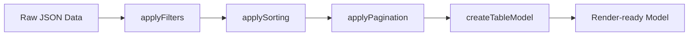

# Headless Table Engine

A powerful, headless table engine that transforms raw JSON data into a render-ready table model through a functional pipe. It handles filtering, sorting, and pagination without being coupled to any specific UI framework.

Official Repository: [github.com/iQliPsE-22/json-to-table](https://github.com/iQliPsE-22/json-to-table)

## Live Demo

Check out the [Live Demo](http://localhost:3000/demo) to see the engine in action with a real dataset.

## The Problem

Table logic (data mapping, sorting algorithms, pagination math) is often mixed with UI components. This makes the code hard to test, difficult to reuse, and leads to "fat components".

## The Solution: Data Pipeline

`table-core` treats table state as a series of pure data transformations.



## Features

- **Headless**: Pure logic. No CSS, no JSX, no DOM. Works with any UI framework.
- **Composable**: Use the functional `pipe` utility to chain transformations.
- **Type-safe**: Built with TypeScript for excellent developer experience.
- **Tested**: Comprehensive unit tests for every core transformation.

## Installation

```bash
npm install table-core
```

## Usage Example

```typescript
import {
  pipe,
  applyFilters,
  applySorting,
  applyPagination,
  createTableModel,
} from "./table-core";

const columns = [
  { key: "id", label: "ID" },
  { key: "title", label: "Product Name" },
  { key: "price", label: "Price ($)" },
];

const products = [
  { id: 1, title: "iPhone 15", price: 999 },
  { id: 2, title: "Samsung S24", price: 899 },
  // ...
];

// Combine transformations into a single predictable model
const tableModel = pipe(
  products,
  (data) => applyFilters(data, [{ key: "title", value: "iPhone" }]),
  (data) => applySorting(data, { key: "price", direction: "desc" }),
  (data) => applyPagination(data, { page: 1, pageSize: 5 }),
  (data) => createTableModel(columns, data)
);
```

## Core API

### `pipe(value, ...fns)`

A functional utility to chain data transformations. Each function in the chain receives the result of the previous one.

### `applyFilters(data, filters)`

Filters the dataset based on an array of key/value pairs. Supports case-insensitive string matching.

### `applySorting(data, sortConfig)`

Sorts the data based on a key and direction (`asc` | `desc`). Handles numbers and strings safely.

### `applyPagination(data, { page, pageSize })`

Slices the data to return a specific page.

### `createTableModel(columns, data)`

Transforms the processed data into a structured `TableModel` ready for rendering in any loop.

## Running Tests

The core engine is fully tested using Vitest:

```bash
npm test
```

## License

MIT © 2025 Deepak
